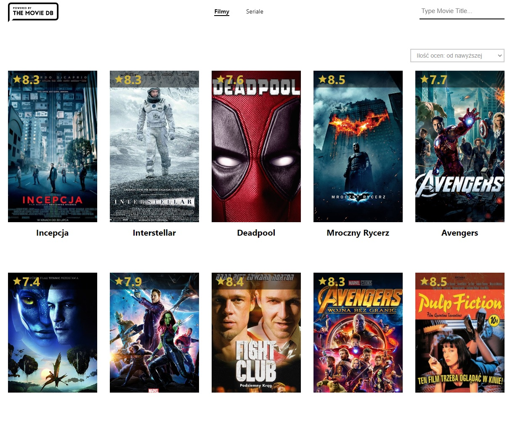
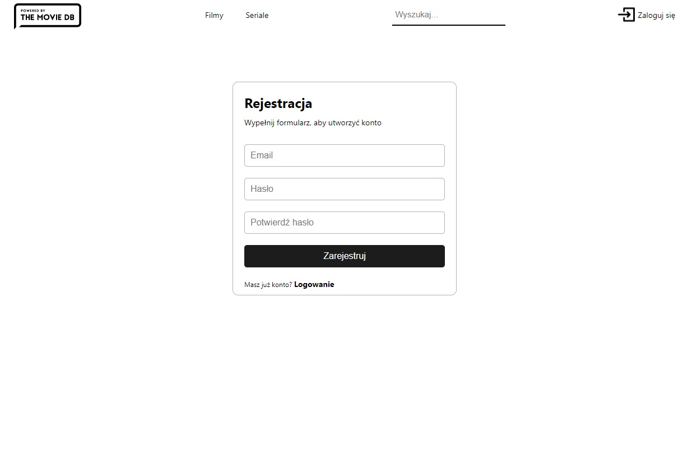
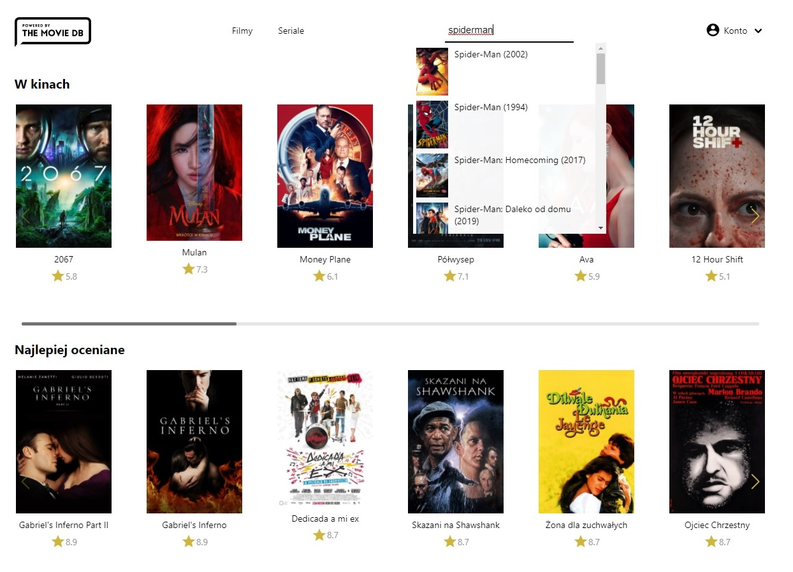

# Movie Service App
> Movie service that offers similar functionalities as Filmweb or IMDB.
>[DEMO](https://tomekxoxo.github.io/movie-search-app/)

## Table of contents
* [General info](#general-info)
* [Screenshots](#screenshots)
* [Technologies](#technologies)
* [Setup](#setup)
* [Features](#features)
* [Status](#status)
* [Contact](#contact)

## General info
App was created for learning purpose.

## Screenshots

## Technologies
* React.js
* Redux
* React-router
* Styled-Components
* Tmdb-api
* FIREBASE

## Setup
Simply download files and open in live server.
If you want to develope please use `npm install` and use scripts saved in package.json.

## Features
* user can search for movies or series by title
* user can filter data with the most common criteria
* user can create personal account
* user can add movies to watchlist and rate movies 

## Status
Project is: finished.

## Contact
Created by tomekxoxo: <tomaszkasprowicz24@gmail.com> - feel free to contact me!
